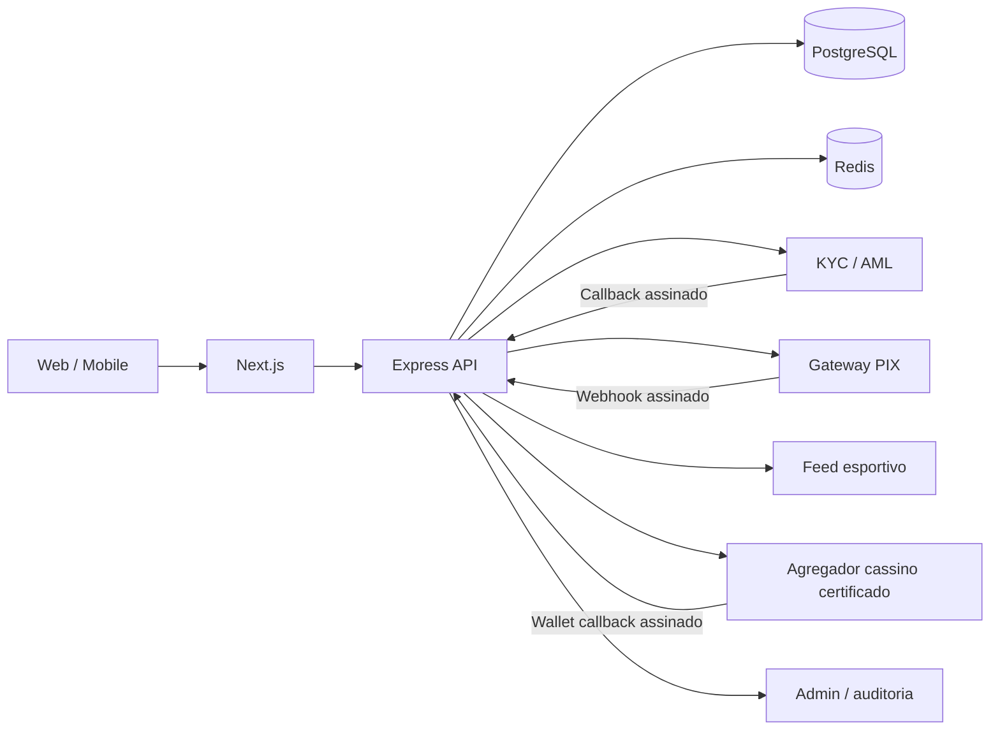

# Arquitetura de produção

## Regras financeiras
- O frontend nunca altera saldo diretamente.
- Toda mutação de carteira ocorre em transação SQL e gera ledger idempotente.
- Depósitos só são creditados após webhook autenticado e confirmação consultada no provedor.
- Stake esportiva move valor de `balance` para `held_balance`.
- Settlement reduz `held_balance` e aplica payout uma única vez.
- Saque reduz saldo no momento do pedido e entra em fila; rejeição gera estorno idempotente.

## Segurança
- Access JWT curto.
- Refresh token rotativo, hash no banco e cookie HttpOnly.
- Rate limiting, Helmet e CORS restrito ao frontend.
- CPF não fica em texto puro.
- Webhooks registram `event_key` único antes do processamento.
